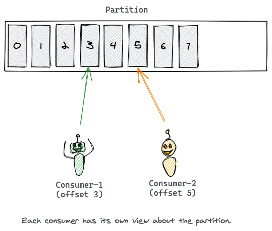

# 컨슈머
* 파티션으로부터 메시지를 읽어 간다. (보통 pub/sub은 컨슈머에 push하여 전달한다) 
* 오프셋을 통해 컨슈머측 커서와 같이 동작. 메시지의 오프셋을 추적해서 읽어온다. 
* 특정 시점에 오프셋에서 재시작 할 수 있다 

* 컨슈머는 반드시 컨슈머그룹에 묶인다 
* 어떤 토픽을 소비하는 컨슈머들을 그룹으로 묶는다. 동일한 컨슈머그룹은 같은 그룹아이디를 부여받는다. 파티션내의 메시지는 그룹내의 컨슈머중 하나에 의해서만 소비되는것을 보장. 
* 컨슈머그룹의 컨슈머수는 파티션수와 일대일로 매핑이 이상적이다. 컨슈머그룹의 컨슈머수가 파티션수보다 더 많으면 대기 상태로만 있는데 가용성은 이미 리벨런싱 동작을 하기에 필요 없다. 
* 오토커밋 설정은 오프셋을 주기적으로 커밋하는건데 만약 컨슈머 종료되거나하면 메시지 못가져오거나 중복으로 가져오게 된다. 하지만 안정적으로 동작하면 오토커밋 많이 사용한다. 
* 메시지 손실되면 안되는것은 동기 커밋을 추천 
* 비동기 커밋은 오프셋 실패하더라도 재시도 하지 않음. 

