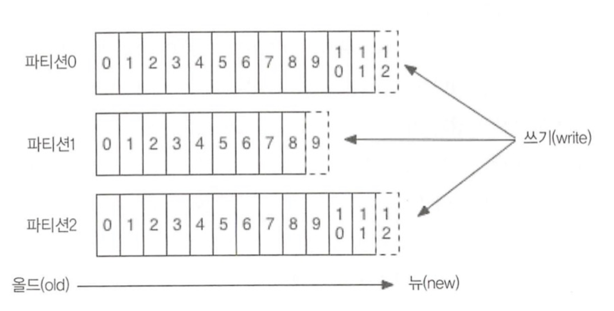

# 토픽,파티션,오프셋
* 카프카는 토픽이란 곳에 데이터를 저장
* **토픽**은 이메일 주소 정도의 개념 
* 토픽은 병렬처리 위해 여러개 **파티션** 단위로 나눔 
* 파티션의 메시지가 저장되는 위치를 **오프셋**
* 오프셋은 64비트 형태로 

* 카프카 파티션안에서는 오프셋으로 순서가 있지만 파티션간에는 순서가 보장되지 않으므로 카프카는 메시지 **순서를 보장하지 않는다**
* 파티션은 브로커 여러개 나눠지고 브로커마다 컨슈머 붙일수 있다. 다만 단일 브로커에 모든 파티션이 있으면 아무래도 컨슈머가 제한된다. 
* 

* 프로듀서가 파티션을 선택해서 메시지를 보낸다 

#dev/kafka