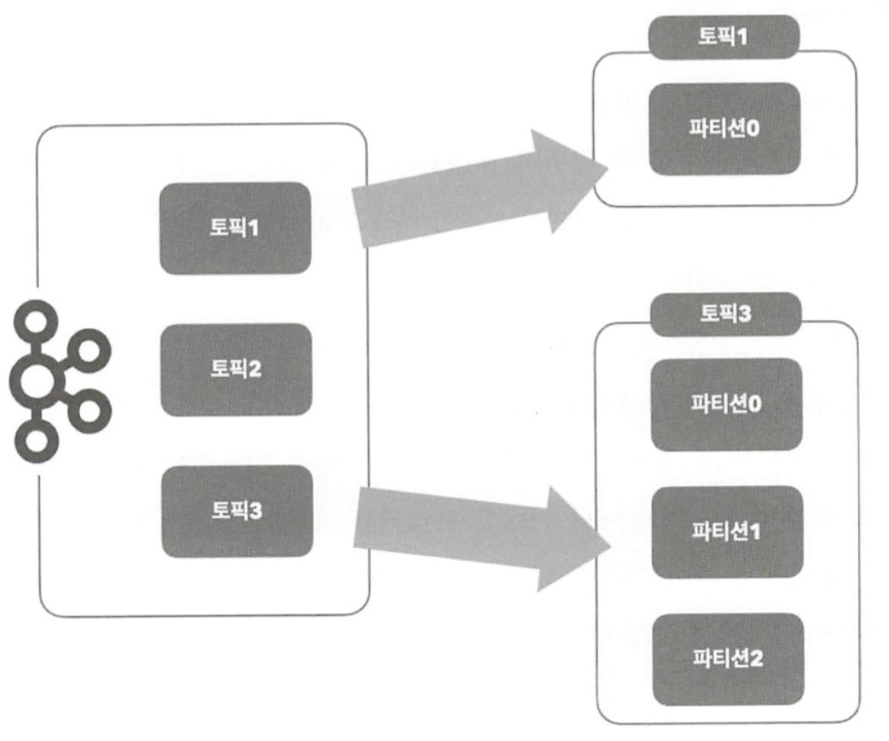

# 파티션 
* 하나의 토픽이 한 번에 처리할 수 있는 한계를 높이기 위해 토픽 하나를 여러 개로 나눠 병렬 처리가 가능하게 만든 것 
* 
* 토픽을 여러 파티션으로 구성 
* 논리적인 개념임 
* 파티션은 한번 늘리면 줄일수 없음 
* 처음에는 2-4로 하고 조금씩 늘리는게 좋음 
* 만약 파티션키로 프로듀서가 전송한다면 되도록이면 파티션수를 변경 안하는게 좋다. 이유는 파티션키에 해당하면 파티션이 변할수 있기 때문. 
* 여러 브로커에 파티션을 나눠서 저장한다 

#dev/kafka