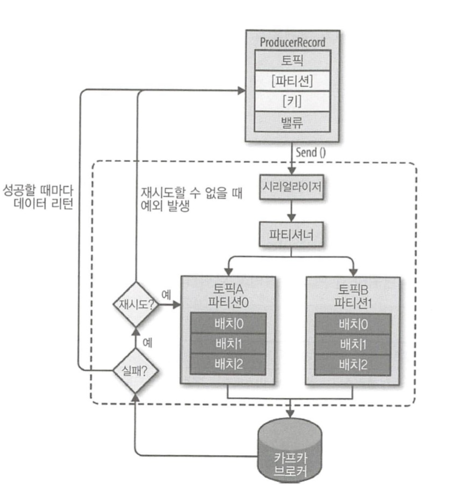

# 프로듀서
* 

* 토픽과 벨류는 필수값 , 파티션과 키는 옵션 

### 프로듀서가 파티션을 선택해서 메시지를 보내는법
* **파티션키** :  

  파티션키(장비ID나 사용자ID)를 사용해서 특정한 파티션에 메시지를 전달한다. 
  파티션키는 해싱 함수를 통해 전달되고 같은 파티션키면 같은 파티션을 유지한다. 
  그말은 같은 파티션키의 순서는 보장 할수 있다는 말이다. 
  다만 하나의 브로커로 몰릴수 있어서 장애로 이어질수 있는게 단점
* **라운드로빈** : 

  고루 분배되지만 순서는 보장되지 않는다 (기본설정)

### send 시 
* 시리얼라이저와 파티셔너를 거친다 
* 파티션 지정했다면 파티셔너 동작하지 않고 지정된 파티션으로 전달 
* 키를 선택했다면 키를 가지고 파티션을 선택해 레코드 전달 
* 프로듀서 내부적으로 send()이후에 파티션별로 모아두어 배치 전송을 한다. 전송 실패하면 재시도. 성공하면 메타데이터. 

	

기본적으로 적어도 한번 전송 방식 기반 
* ACK 못받은 메시지는 재전송해서 중복이 발생할수 있더라도 어떻게든 ACK기반으로 메시지 전송에 집착한다 

최대 한 번 전송
* ACK 못받아도 재전송 하지 않고 다음 전송한다 

중복 없는 전송 
* 헤더에 PID와 메시지번호를 넣어서 보내고 브로커의 메모리에 저장해서 재전송시 비교해서 메시지번호에 해당하는게 있으면 저장하지 않아 중복을 방지 한다. 

	

#dev/kafka